# GatheringRef - Application Flowcharts

This document contains comprehensive flowcharts for all user flows in the GatheringRef application.

---

## Table of Contents
1. [Authentication Flow](#1-authentication-flow)
2. [Password Recovery Flow](#2-password-recovery-flow)
3. [Gallery Management Flow](#3-gallery-management-flow)
4. [Image Management Flow](#4-image-management-flow)
5. [Public Gallery Access Flow](#5-public-gallery-access-flow)
6. [Settings Flow](#6-settings-flow)

---

## 1. Authentication Flow

### 1.1 User Registration

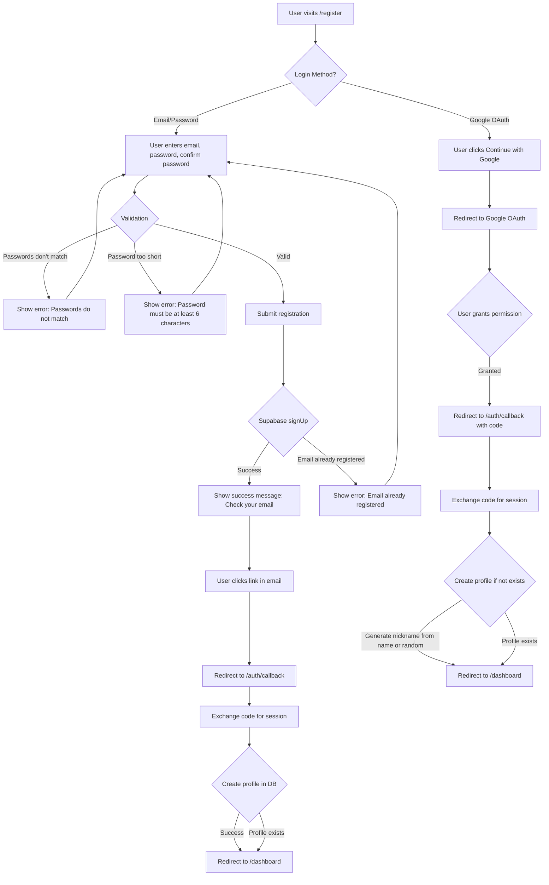

### 1.2 User Login

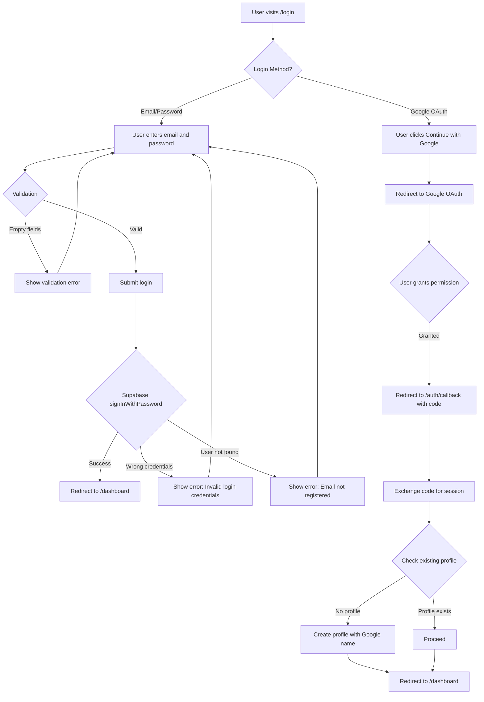

### 1.3 User Logout

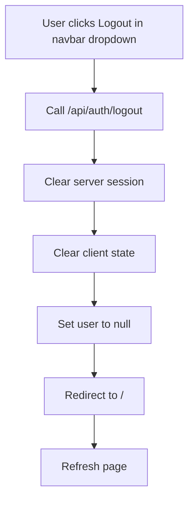

### 1.4 Auth Callback (OAuth)

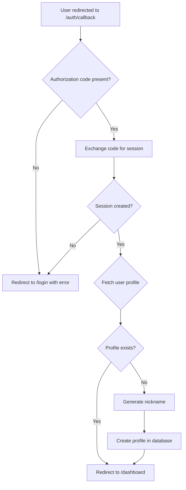

---

## 2. Password Recovery Flow

### 2.1 Forgot Password

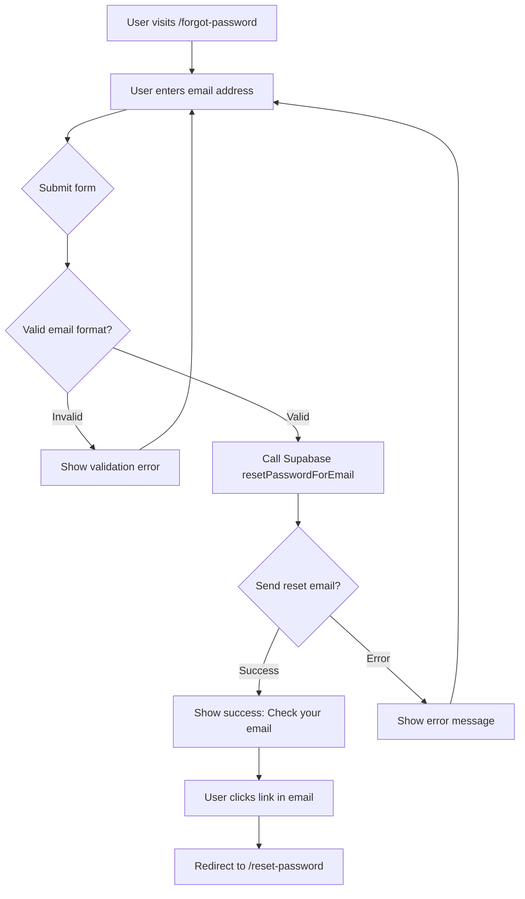

### 2.2 Reset Password

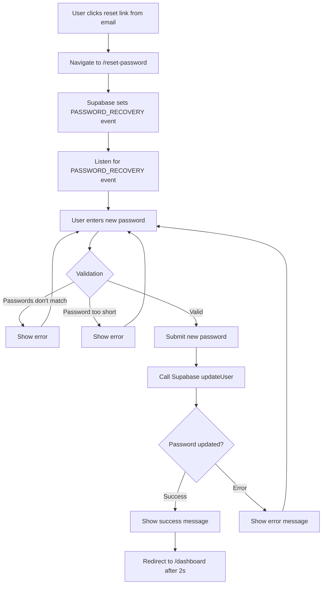

---

## 3. Gallery Management Flow

### 3.1 View Dashboard

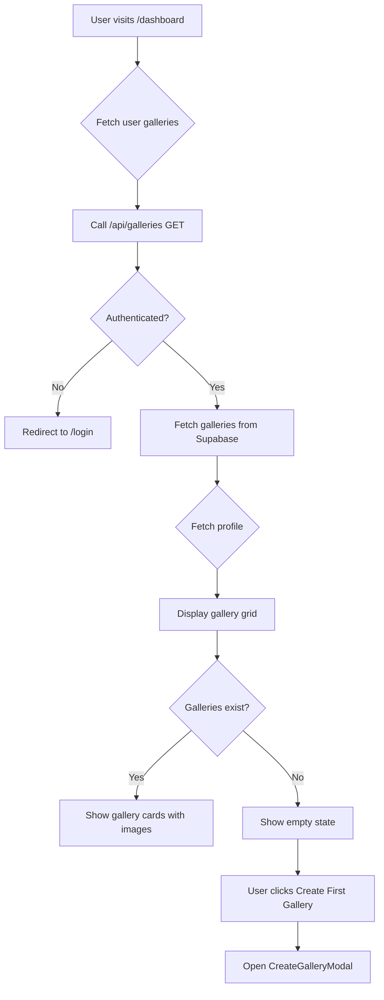

### 3.2 Create Gallery

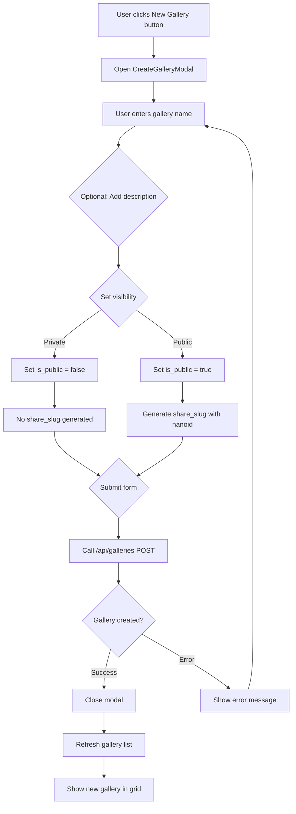

### 3.3 View Gallery Detail

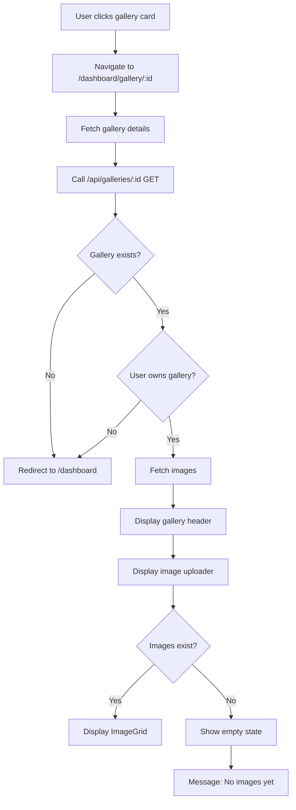

### 3.4 Edit Gallery Settings

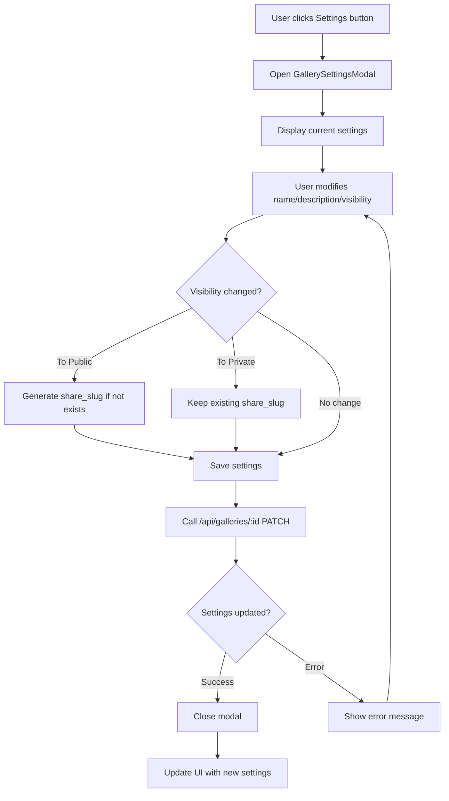

### 3.5 Delete Gallery

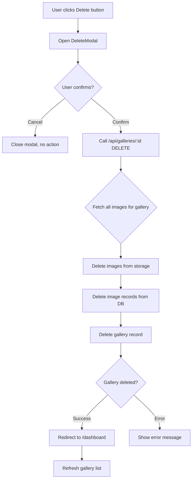

---

## 4. Image Management Flow

### 4.1 Upload Images

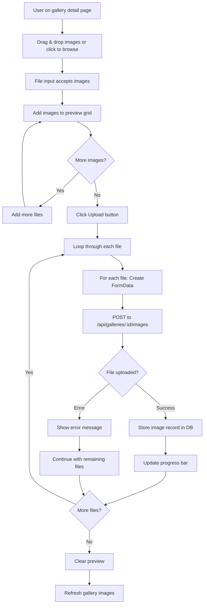

### 4.2 Delete Image

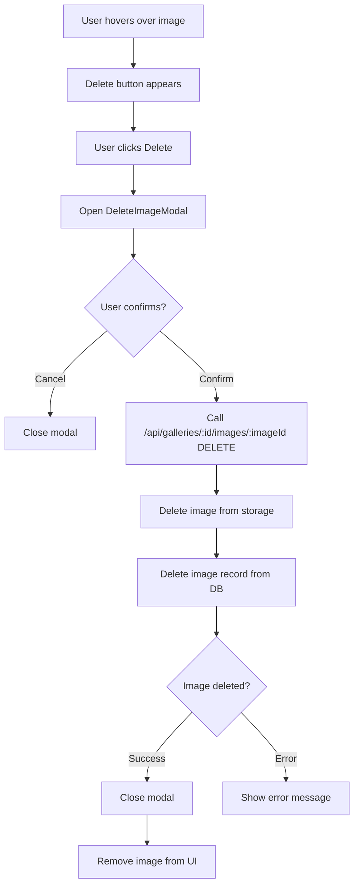

---

## 5. Public Gallery Access Flow

### 5.1 View Public Gallery

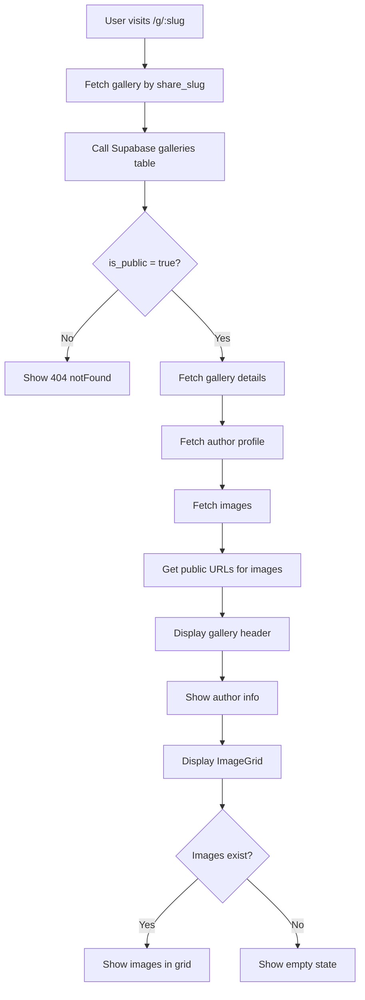

### 5.2 Share Gallery

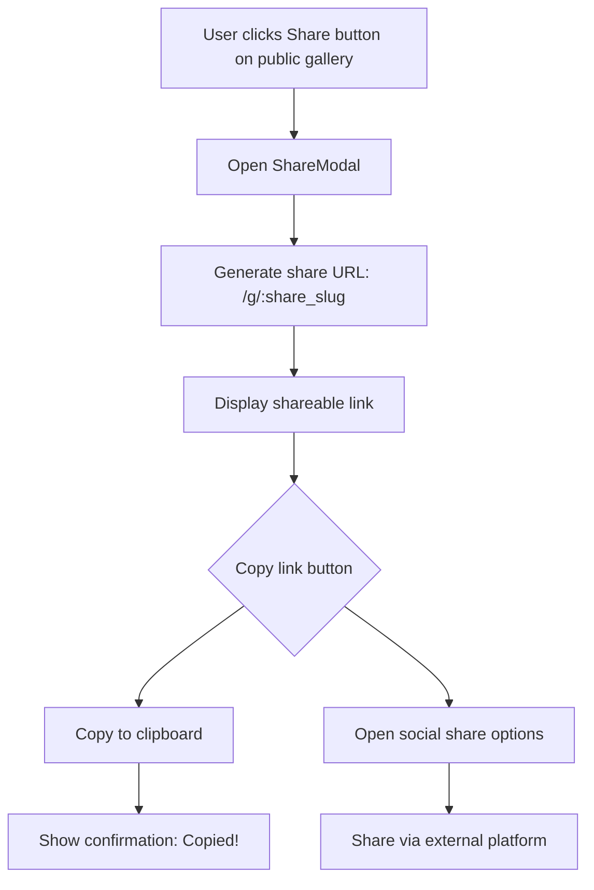

---

## 6. Settings Flow

### 6.1 View & Update Profile

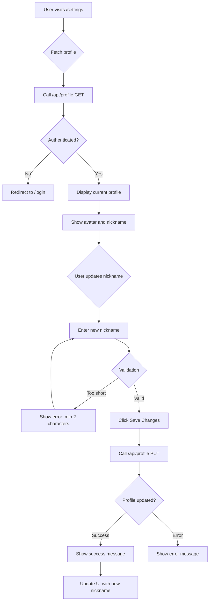

### 6.2 Upload Avatar

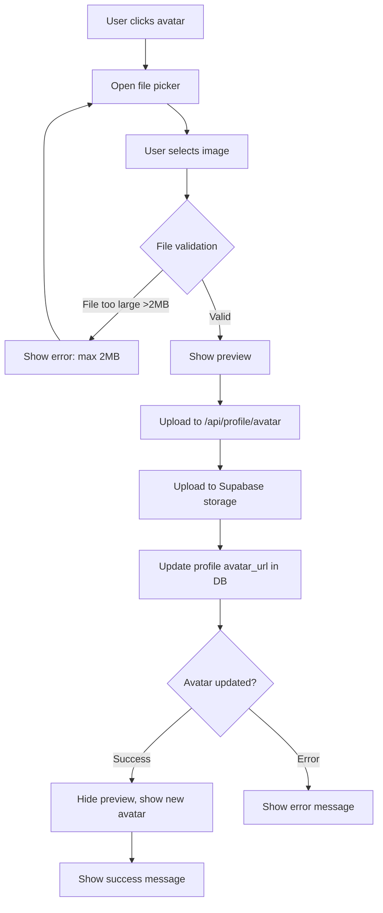

---

## User Navigation Flow Summary

```mermaid
flowchart LR
    subgraph Public
        A[Home Page] --> B[/register]
        A --> C[/login]
        A --> D[/g/:slug - Public Gallery]
    end
    
    subgraph Auth
        B --> E[Registration Flow]
        C --> F[Login Flow]
        E --> G[/auth/callback]
        F --> G
    end
    
    subgraph Protected
        G --> H[/dashboard]
        H --> I[/dashboard/gallery/:id]
        I --> J[Gallery Detail]
        H --> K[/settings]
    end
    
    subgraph Actions
        J --> L[Upload Image]
        J --> M[Share Gallery]
        J --> N[Edit Gallery]
        J --> O[Delete Gallery]
        K --> P[Update Profile]
    end
```

---

## Error Handling Summary

| Flow | Error State | User Experience |
|------|-------------|-----------------|
| Registration | Email already exists | Show localized error message |
| Login | Wrong credentials | Show "Invalid login credentials" |
| Gallery Create | Name required | Disable submit until valid |
| Image Upload | File too large | Show file size error |
| Gallery Delete | API error | Show error, keep modal open |
| Profile Update | Not authenticated | Redirect to login |

---

*Document generated for GatheringRef application*
